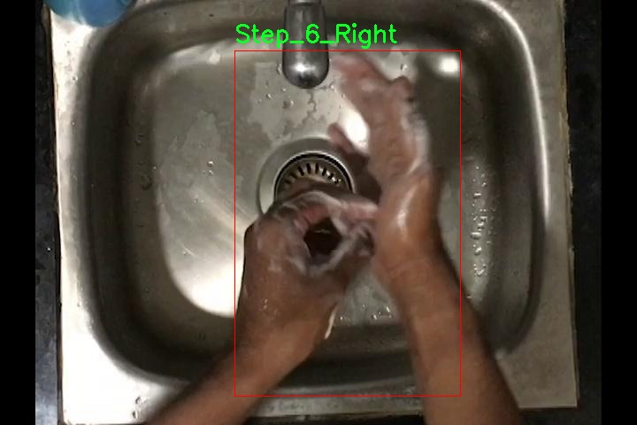

### 1.背景意义

研究背景与意义

随着公共卫生意识的提高，手部清洗作为预防疾病传播的重要措施，越来越受到重视。尤其是在新冠疫情后，正确的手部清洗步骤被广泛推广，成为个人卫生的重要组成部分。然而，尽管手部清洗的重要性不言而喻，许多人在实际操作中仍存在误区，导致清洗效果不佳。因此，开发一个能够准确识别手部清洗步骤的系统，不仅能够帮助用户掌握正确的清洗方法，还能在公共卫生教育中发挥重要作用。

本研究旨在基于改进的YOLOv11模型，构建一个手部清洗步骤识别系统。该系统将利用一个包含7057张图像的数据集，数据集中涵盖了12个不同的手部清洗步骤，具体包括多个步骤的左右手操作。这种细致的分类将使得系统能够更准确地识别和指导用户完成每一个步骤，从而提升手部清洗的规范性和有效性。

在计算机视觉领域，YOLO（You Only Look Once）系列模型因其高效的实时目标检测能力而备受关注。通过对YOLOv11的改进，我们期望能够进一步提升模型在手部清洗步骤识别中的准确性和鲁棒性。数据集的构建和预处理环节也将为模型的训练提供坚实的基础。具体而言，数据集经过了多种增强处理，包括随机翻转、裁剪和旋转等，这将有助于提高模型的泛化能力，适应不同环境和用户的手部清洗习惯。

综上所述，本研究不仅具有重要的理论意义，还具备广泛的应用前景。通过构建一个智能化的手部清洗步骤识别系统，我们希望能够在提升公众卫生意识的同时，推动计算机视觉技术在健康领域的应用，为未来的公共卫生管理提供新的解决方案。

### 2.视频效果

[2.1 视频效果](https://www.bilibili.com/video/BV1Q3SMY3EBA/)

### 3.图片效果


##### [项目涉及的源码数据来源链接](https://kdocs.cn/l/cszuIiCKVNis)**

注意：本项目提供训练的数据集和训练教程,由于版本持续更新,暂不提供权重文件（best.pt）,请按照6.训练教程进行训练后实现上图演示的效果。

### 4.数据集信息

##### 4.1 本项目数据集类别数＆类别名

nc: 12
names: ['Step_1', 'Step_2_Left', 'Step_2_Right', 'Step_3', 'Step_4_Left', 'Step_4_Right', 'Step_5_Left', 'Step_5_Right', 'Step_6_Left', 'Step_6_Right', 'Step_7_Left', 'Step_7_Right']


该项目为【目标检测】数据集，请在【训练教程和Web端加载模型教程（第三步）】这一步的时候按照【目标检测】部分的教程来训练

##### 4.2 本项目数据集信息介绍

本项目数据集信息介绍

本项目所使用的数据集旨在为改进YOLOv11的手部清洗步骤识别系统提供强有力的支持。该数据集以“Steps auto data”为主题，专注于手部清洗过程中的各个步骤，通过精确的标注和丰富的样本，为模型的训练和评估奠定了坚实的基础。数据集中共包含12个类别，分别为‘Step_1’，‘Step_2_Left’，‘Step_2_Right’，‘Step_3’，‘Step_4_Left’，‘Step_4_Right’，‘Step_5_Left’，‘Step_5_Right’，‘Step_6_Left’，‘Step_6_Right’，‘Step_7_Left’和‘Step_7_Right’。这些类别细致地划分了手部清洗的不同步骤，确保模型能够在多样化的场景中准确识别和分类。

数据集的构建过程中，采用了多种数据采集手段，包括视频录制和图像捕捉，确保了数据的多样性和真实性。每个步骤的图像和视频样本均经过精确标注，以便于模型在训练时能够学习到每个步骤的独特特征。此外，数据集中还考虑了不同光照条件、背景环境和手部动作的变化，使得模型在实际应用中具备更强的鲁棒性和适应性。

通过对该数据集的深入分析与利用，研究团队期望能够显著提升YOLOv11在手部清洗步骤识别中的性能，进而推动相关领域的研究和应用。数据集的丰富性和系统性将为后续的模型优化和算法改进提供重要的数据支持，助力实现更高效的手部清洗过程监测与指导。





### 5.全套项目环境部署视频教程（零基础手把手教学）

[5.1 所需软件PyCharm和Anaconda安装教程（第一步）](https://www.bilibili.com/video/BV1BoC1YCEKi/?spm_id_from=333.999.0.0&vd_source=bc9aec86d164b67a7004b996143742dc)


[5.2 安装Python虚拟环境创建和依赖库安装视频教程（第二步）](https://www.bilibili.com/video/BV1ZoC1YCEBw?spm_id_from=333.788.videopod.sections&vd_source=bc9aec86d164b67a7004b996143742dc)

### 6.改进YOLOv11训练教程和Web_UI前端加载模型教程（零基础手把手教学）

[6.1 改进YOLOv11训练教程和Web_UI前端加载模型教程（第三步）](https://www.bilibili.com/video/BV1BoC1YCEhR?spm_id_from=333.788.videopod.sections&vd_source=bc9aec86d164b67a7004b996143742dc)


按照上面的训练视频教程链接加载项目提供的数据集，运行train.py即可开始训练



     Epoch   gpu_mem       box       obj       cls    labels  img_size
     1/200     20.8G   0.01576   0.01955  0.007536        22      1280: 100%|██████████| 849/849 [14:42<00:00,  1.04s/it]
               Class     Images     Labels          P          R     mAP@.5 mAP@.5:.95: 100%|██████████| 213/213 [01:14<00:00,  2.87it/s]
                 all       3395      17314      0.994      0.957      0.0957      0.0843

     Epoch   gpu_mem       box       obj       cls    labels  img_size
     2/200     20.8G   0.01578   0.01923  0.007006        22      1280: 100%|██████████| 849/849 [14:44<00:00,  1.04s/it]
               Class     Images     Labels          P          R     mAP@.5 mAP@.5:.95: 100%|██████████| 213/213 [01:12<00:00,  2.95it/s]
                 all       3395      17314      0.996      0.956      0.0957      0.0845

     Epoch   gpu_mem       box       obj       cls    labels  img_size
     3/200     20.8G   0.01561    0.0191  0.006895        27      1280: 100%|██████████| 849/849 [10:56<00:00,  1.29it/s]
               Class     Images     Labels          P          R     mAP@.5 mAP@.5:.95: 100%|███████   | 187/213 [00:52<00:00,  4.04it/s]
                 all       3395      17314      0.996      0.957      0.0957      0.0845


###### [项目数据集下载链接](https://kdocs.cn/l/cszuIiCKVNis)

### 7.原始YOLOv11算法讲解


##### YOLOv11三大损失函数

YOLOv11（You Only Look Once）是一种流行的目标检测算法，其损失函数设计用于同时优化分类和定位任务。YOLO的损失函数通常包括几个部分：
**分类损失、定位损失（边界框回归损失）和置信度损失** 。其中，

  1. box_loss（边界框回归损失）是用于优化预测边界框与真实边界框之间的差异的部分。

  2. cls_loss（分类损失）是用于优化模型对目标类别的预测准确性的部分。分类损失确保模型能够正确地识别出图像中的对象属于哪个类别。

  3. dfl_loss（Distribution Focal Loss）是YOLO系列中的一种损失函数，特别是在一些改进版本如YOLOv5和YOLOv7中被引入。它的主要目的是解决目标检测中的类别不平衡问题，并提高模型在处理小目标和困难样本时的性能。

##### 边界框回归损失详解

box_loss（边界框回归损失）是用于优化预测边界框与真实边界框之间的差异的部分。


##### box_loss 的具体意义


##### 为什么需要 box_loss

  * 精确定位：通过最小化中心点坐标损失和宽高损失，模型能够更准确地预测目标的位置和大小。
  * 平衡不同类型的目标：使用平方根来处理宽高损失，可以更好地平衡不同大小的目标，确保小目标也能得到足够的关注。
  * 稳定训练：适当的损失函数设计有助于模型的稳定训练，避免梯度爆炸或消失等问题。

##### 分类损失详解

在YOLO（You Only Look
Once）目标检测算法中，cls_loss（分类损失）是用于优化模型对目标类别的预测准确性的部分。分类损失确保模型能够正确地识别出图像中的对象属于哪个类别。下面是关于cls_loss的详细解读：

##### 分类损失 (cls_loss) 的具体意义

  
分类损失通常使用交叉熵损失（Cross-Entropy
Loss）来计算。交叉熵损失衡量的是模型预测的概率分布与真实标签之间的差异。在YOLO中，分类损失的具体形式如下：


##### 为什么需要 cls_loss

  * 类别识别：cls_loss 确保模型能够正确识别出图像中的目标属于哪个类别。这对于目标检测任务至关重要，因为不仅需要知道目标的位置，还需要知道目标的类型。

  * 多类别支持：通过最小化分类损失，模型可以处理多个类别的目标检测任务。例如，在道路缺陷检测中，可能需要识别裂缝、坑洞、路面破损等多种类型的缺陷。

  * 提高准确性：分类损失有助于提高模型的分类准确性，从而提升整体检测性能。通过优化分类损失，模型可以更好地学习不同类别之间的特征差异。

##### 分布损失详解

`dfl_loss`（Distribution Focal
Loss）是YOLO系列中的一种损失函数，特别是在一些改进版本如YOLOv5和YOLOv7中被引入。它的主要目的是解决目标检测中的类别不平衡问题，并提高模型在处理小目标和困难样本时的性能。下面是对`dfl_loss`的详细解读：

##### DFL Loss 的背景

在目标检测任务中，类别不平衡是一个常见的问题。某些类别的样本数量可能远远多于其他类别，这会导致模型在训练过程中对常见类别的学习效果较好，而对罕见类别的学习效果较差。此外，小目标和困难样本的检测也是一个挑战，因为这些目标通常具有较少的特征信息，容易被忽略或误分类。

为了应对这些问题，研究者们提出了多种改进方法，其中之一就是`dfl_loss`。`dfl_loss`通过引入分布焦点损失来增强模型对困难样本的关注，并改善类别不平衡问题。

##### DFL Loss 的定义

DFL Loss
通常与传统的交叉熵损失结合使用，以增强模型对困难样本的学习能力。其核心思想是通过对每个类别的预测概率进行加权，使得模型更加关注那些难以正确分类的样本。

DFL Loss 的公式可以表示为：


##### DFL Loss 的具体意义**

  * **类别不平衡：** 通过引入平衡因子 α，DFL Loss 可以更好地处理类别不平衡问题。对于少数类别的样本，可以通过增加其权重来提升其重要性，从而提高模型对这些类别的检测性能。
  *  **困难样本：** 通过聚焦参数 γ，DFL Loss 可以让模型更加关注那些难以正确分类的样本。当 
  * γ 较大时，模型会对那些预测概率较低的样本给予更多的关注，从而提高这些样本的分类准确性。
  *  **提高整体性能** ：DFL Loss 结合了传统交叉熵损失的优势，并通过加权机制增强了模型对困难样本的学习能力，从而提高了整体的检测性能。


### 8.200+种全套改进YOLOV11创新点原理讲解

#### 8.1 200+种全套改进YOLOV11创新点原理讲解大全

由于篇幅限制，每个创新点的具体原理讲解就不全部展开，具体见下列网址中的改进模块对应项目的技术原理博客网址【Blog】（创新点均为模块化搭建，原理适配YOLOv5~YOLOv11等各种版本）

[改进模块技术原理博客【Blog】网址链接](https://gitee.com/qunmasj/good)


#### 8.2 精选部分改进YOLOV11创新点原理讲解

###### 这里节选部分改进创新点展开原理讲解(完整的改进原理见上图和[改进模块技术原理博客链接](https://gitee.com/qunmasj/good)【如果此小节的图加载失败可以通过CSDN或者Github搜索该博客的标题访问原始博客，原始博客图片显示正常】

### 上下文引导网络（CGNet）简介


高准确率的模型（蓝点），由图像分类网络转化而来且参数量大，因此大多不适于移动设备。
低分辨率的小模型（红点），遵循分类网络的设计方式，忽略了分割特性，故而效果不好。
#### CGNet的设计：
为了提升准确率，用cgnet探索语义分割的固有属性。对于准确率的提升，因为语义分割是像素级分类和目标定位，所以空间依赖性和上下文信息发挥了重要作用。因此，设计cg模块，用于建模空间依赖性和语义上下文信息。
- 1、cg模块学习局部特征和周围特征形成联合特征
- 2、通过逐通道重新加权（强调有用信息，压缩无用信息），用全局特征改善联合特征
- 3、在全阶段应用cg模块，以便从语义层和空间层捕捉信息。
为了降低参数量：1、深层窄网络，尽可能节约内存 2、用通道卷积


之前的网络根据框架可分三类：
- 1、FCN-shape的模型，遵循分类网络的设计，忽略了上下文信息 ESPNet、ENet、fcn
- 2、FCN-CM模型，在编码阶段后用上下文模块捕捉语义级信息 DPC、DenseASPP、DFN、PSPNet
- 3、（our）在整个阶段捕捉上下文特征
- 4、主流分割网络的下采样为五次，学习了很多关于物体的抽象特征，丢失了很多有鉴别性的空间信息，导致分割边界过于平滑，（our）仅采用三次下采样，利于保存空间信息


#### cg模块

Cg模块：
思路：人类视觉系统依赖上下文信息理解场景。
如图3,a， 如若仅关注黄色框框，很难分辨，也就是说，仅关注局部特征不容易正确识别目标的类别。 然后，如果加入了目标周围的特征，即图3,b，就很容易识别正确，所以周围特征对于语义分割是很有帮助的。在此基础上，如果进一步用整个场景的特征加以辅助，将会有更高的程度去争正确分类黄色框框的物体，如图3,c所示。 故，周围上下文和全局上下文对于提升分割精度都是有帮助的。


实现：基于此，提出cg模块，利用局部特征，周围上下文以及全局上下文。如图3,d所示。该模块共包含两个阶段。

第一步，floc( ) 局部和 fsur( )周围函数分别学习对应特征。floc( )用3x3卷积从周围8个点提取特征，对应于黄色框框；同时fsur( )用感受野更大的3x3带孔卷积学习周围上下文，对应红色框框。然后fjoi( )是指将前两路特征concat之后经BN，PReLU。此一部分是cg模块的第一步。
对于模块的第二步，fglo( )用于提取全局特征，改善联合特征。受SENet启发，全局上下文被认为是一个加权向量，用于逐通道微调联合特征，以强调有用元素、压缩无用元素。在本论文中，fglo( )用GAP产生聚合上下文特征，然后用多层感知机进一步提取全局上下文。最后，使用一个尺度层对联合特征重新加权用提取的全局上下文。
残差连接有利于学习更复杂的特征以及便于训练时梯度反向传播。两个拟设计方案，LRL局部残差连接和GRL全局残差连接，实验证明（消融实验），GRL效果更好

#### CGNet网络


原则：深、瘦（deep and thin）以节省内存。层数少，通道数少，三个下采样。

Stage1，三个标准卷积层，分辨率变成原来的1/2

Stage2和stage3，分别堆叠M和N个cg模块。该两个阶段，第一层的输入是前一阶段第一个和最后一个block的结合（how结合）利于特征重用和特征传播。

将输入图像下采样到1/4和1/8分别输入到第2和3阶段。

最后，用1x1卷积层进行分割预测。

为进一步降低参数量，局部和周围特征提取器采用了逐通道卷积。之前有的工作在逐通道卷积后采用1x1卷积用以改善通道间的信息流动，本文消融实验显示效果不好，分析：因为cg模块中提取的局部和全局特征需要保持通道独立性，所以本论文不使用1*1卷积。


### 9.系统功能展示

图9.1.系统支持检测结果表格显示

  图9.2.系统支持置信度和IOU阈值手动调节

  图9.3.系统支持自定义加载权重文件best.pt(需要你通过步骤5中训练获得)

  图9.4.系统支持摄像头实时识别

  图9.5.系统支持图片识别

  图9.6.系统支持视频识别

  图9.7.系统支持识别结果文件自动保存

  图9.8.系统支持Excel导出检测结果数据


### 10. YOLOv11核心改进源码讲解

#### 10.1 fast_kan_conv.py

以下是经过简化和注释的核心代码，保留了主要的功能和结构。

```python
import torch
import torch.nn as nn

# 定义径向基函数（Radial Basis Function）类
class RadialBasisFunction(nn.Module):
    def __init__(self, grid_min: float = -2., grid_max: float = 2., num_grids: int = 8, denominator: float = None):
        super().__init__()
        # 在指定范围内生成均匀分布的网格点
        grid = torch.linspace(grid_min, grid_max, num_grids)
        self.grid = torch.nn.Parameter(grid, requires_grad=False)  # 网格点作为不可训练的参数
        self.denominator = denominator or (grid_max - grid_min) / (num_grids - 1)  # 计算分母

    def forward(self, x):
        # 计算径向基函数的输出
        return torch.exp(-((x[..., None] - self.grid) / self.denominator) ** 2)

# 定义FastKAN卷积层类
class FastKANConvNDLayer(nn.Module):
    def __init__(self, conv_class, norm_class, input_dim, output_dim, kernel_size, groups=1, padding=0, stride=1, dilation=1, ndim: int = 2, grid_size=8, base_activation=nn.SiLU, grid_range=[-2, 2], dropout=0.0):
        super(FastKANConvNDLayer, self).__init__()
        # 初始化参数
        self.inputdim = input_dim
        self.outdim = output_dim
        self.kernel_size = kernel_size
        self.padding = padding
        self.stride = stride
        self.dilation = dilation
        self.groups = groups
        self.ndim = ndim
        self.grid_size = grid_size
        self.base_activation = base_activation()  # 基础激活函数
        self.grid_range = grid_range

        # 检查参数有效性
        if groups <= 0:
            raise ValueError('groups must be a positive integer')
        if input_dim % groups != 0:
            raise ValueError('input_dim must be divisible by groups')
        if output_dim % groups != 0:
            raise ValueError('output_dim must be divisible by groups')

        # 创建基础卷积层和样条卷积层
        self.base_conv = nn.ModuleList([conv_class(input_dim // groups, output_dim // groups, kernel_size, stride, padding, dilation, groups=1, bias=False) for _ in range(groups)])
        self.spline_conv = nn.ModuleList([conv_class(grid_size * input_dim // groups, output_dim // groups, kernel_size, stride, padding, dilation, groups=1, bias=False) for _ in range(groups)])
        self.layer_norm = nn.ModuleList([norm_class(output_dim // groups) for _ in range(groups)])

        # 初始化径向基函数
        self.rbf = RadialBasisFunction(grid_range[0], grid_range[1], grid_size)

        # 初始化dropout层
        self.dropout = nn.Dropout2d(p=dropout) if ndim == 2 else nn.Dropout3d(p=dropout) if ndim == 3 else nn.Dropout1d(p=dropout) if ndim == 1 else None

        # 使用Kaiming均匀分布初始化卷积层权重
        for conv_layer in self.base_conv:
            nn.init.kaiming_uniform_(conv_layer.weight, nonlinearity='linear')
        for conv_layer in self.spline_conv:
            nn.init.kaiming_uniform_(conv_layer.weight, nonlinearity='linear')

    def forward_fast_kan(self, x, group_index):
        # 计算基础卷积的输出
        base_output = self.base_conv[group_index](self.base_activation(x))
        if self.dropout is not None:
            x = self.dropout(x)  # 应用dropout
        # 计算样条卷积的输出
        spline_basis = self.rbf(self.layer_norm[group_index](x))
        spline_basis = spline_basis.moveaxis(-1, 2).flatten(1, 2)  # 调整维度以适应卷积
        spline_output = self.spline_conv[group_index](spline_basis)
        # 返回基础输出和样条输出的和
        return base_output + spline_output

    def forward(self, x):
        # 将输入分成多个组进行处理
        split_x = torch.split(x, self.inputdim // self.groups, dim=1)
        output = []
        for group_ind, _x in enumerate(split_x):
            y = self.forward_fast_kan(_x.clone(), group_ind)  # 处理每个组
            output.append(y.clone())
        y = torch.cat(output, dim=1)  # 合并输出
        return y

# 定义FastKAN的3D卷积层
class FastKANConv3DLayer(FastKANConvNDLayer):
    def __init__(self, input_dim, output_dim, kernel_size, groups=1, padding=0, stride=1, dilation=1, grid_size=8, base_activation=nn.SiLU, grid_range=[-2, 2], dropout=0.0):
        super(FastKANConv3DLayer, self).__init__(nn.Conv3d, nn.InstanceNorm3d, input_dim, output_dim, kernel_size, groups=groups, padding=padding, stride=stride, dilation=dilation, ndim=3, grid_size=grid_size, base_activation=base_activation, grid_range=grid_range, dropout=dropout)

# 定义FastKAN的2D卷积层
class FastKANConv2DLayer(FastKANConvNDLayer):
    def __init__(self, input_dim, output_dim, kernel_size, groups=1, padding=0, stride=1, dilation=1, grid_size=8, base_activation=nn.SiLU, grid_range=[-2, 2], dropout=0.0):
        super(FastKANConv2DLayer, self).__init__(nn.Conv2d, nn.InstanceNorm2d, input_dim, output_dim, kernel_size, groups=groups, padding=padding, stride=stride, dilation=dilation, ndim=2, grid_size=grid_size, base_activation=base_activation, grid_range=grid_range, dropout=dropout)

# 定义FastKAN的1D卷积层
class FastKANConv1DLayer(FastKANConvNDLayer):
    def __init__(self, input_dim, output_dim, kernel_size, groups=1, padding=0, stride=1, dilation=1, grid_size=8, base_activation=nn.SiLU, grid_range=[-2, 2], dropout=0.0):
        super(FastKANConv1DLayer, self).__init__(nn.Conv1d, nn.InstanceNorm1d, input_dim, output_dim, kernel_size, groups=groups, padding=padding, stride=stride, dilation=dilation, ndim=1, grid_size=grid_size, base_activation=base_activation, grid_range=grid_range, dropout=dropout)
```

### 代码说明
1. **RadialBasisFunction**: 该类实现了径向基函数，主要用于生成基于输入的平滑输出。
2. **FastKANConvNDLayer**: 这是一个通用的卷积层类，支持1D、2D和3D卷积。它包含基础卷积层、样条卷积层和层归一化，能够处理分组卷积。
3. **forward_fast_kan**: 该方法处理输入数据，计算基础卷积和样条卷积的输出，并将它们相加。
4. **forward**: 该方法将输入分成多个组，并对每个组调用`forward_fast_kan`进行处理，最后合并输出。
5. **FastKANConv3DLayer、FastKANConv2DLayer、FastKANConv1DLayer**: 这些类分别实现了3D、2D和1D的FastKAN卷积层，继承自`FastKANConvNDLayer`，并指定了相应的卷积和归一化类。

这个文件定义了一个用于快速卷积神经网络的模块，主要包括一个径向基函数（Radial Basis Function）和一个多维卷积层（FastKANConvNDLayer），以及针对不同维度的卷积层（1D、2D、3D）。

首先，`RadialBasisFunction`类是一个自定义的神经网络模块，主要用于生成径向基函数。它的构造函数接受一些参数，包括网格的最小值和最大值、网格的数量以及一个分母值。网格是通过`torch.linspace`生成的，并且被定义为一个不可训练的参数。`forward`方法接受输入`x`，并计算出基于网格的径向基函数值，返回一个张量。

接下来，`FastKANConvNDLayer`类是一个多维卷积层的实现。它的构造函数接受多个参数，包括输入和输出维度、卷积核大小、分组数、填充、步幅、扩张、网格大小、基础激活函数、网格范围和丢弃率等。构造函数中会检查分组数是否为正整数，并确保输入和输出维度能够被分组数整除。然后，创建基础卷积层和样条卷积层的模块列表，并使用实例归一化。径向基函数实例也在这里创建。根据提供的丢弃率，可能会添加相应的丢弃层。

`forward_fast_kan`方法实现了快速KAN卷积的前向传播。它首先对输入应用基础激活函数，然后通过基础卷积层进行线性变换。接着，如果有丢弃层，则对输入应用丢弃。之后，使用层归一化对输入进行处理，并计算样条基函数，最后通过样条卷积层得到输出。最终的输出是基础卷积输出和样条卷积输出的和。

`forward`方法则是对输入进行分组处理，并对每个组调用`forward_fast_kan`，最后将所有组的输出拼接在一起。

最后，`FastKANConv3DLayer`、`FastKANConv2DLayer`和`FastKANConv1DLayer`类分别继承自`FastKANConvNDLayer`，用于实现三维、二维和一维的卷积层。这些类在初始化时指定了相应的卷积类型（`nn.Conv3d`、`nn.Conv2d`、`nn.Conv1d`）和归一化类型（`nn.InstanceNorm3d`、`nn.InstanceNorm2d`、`nn.InstanceNorm1d`），以便于在不同维度上使用。

整体来看，这个文件实现了一个灵活且高效的卷积神经网络模块，结合了径向基函数和多维卷积，适用于各种输入数据的处理。

#### 10.2 predict.py

以下是经过简化和注释的核心代码部分：

```python
# 导入必要的模块
from ultralytics.engine.predictor import BasePredictor
from ultralytics.engine.results import Results
from ultralytics.utils import ops

class DetectionPredictor(BasePredictor):
    """
    扩展自 BasePredictor 类的检测预测器，用于基于检测模型进行预测。
    """

    def postprocess(self, preds, img, orig_imgs):
        """
        对预测结果进行后处理，并返回结果对象的列表。

        参数:
        preds: 模型的原始预测结果
        img: 输入图像
        orig_imgs: 原始输入图像，可能是一个张量或列表

        返回:
        results: 包含后处理结果的 Results 对象列表
        """
        # 应用非极大值抑制（NMS）来过滤重叠的检测框
        preds = ops.non_max_suppression(
            preds,
            self.args.conf,  # 置信度阈值
            self.args.iou,    # IOU 阈值
            agnostic=self.args.agnostic_nms,  # 是否使用类别无关的 NMS
            max_det=self.args.max_det,  # 最大检测框数量
            classes=self.args.classes,  # 需要检测的类别
        )

        # 如果输入的原始图像不是列表，则将其转换为 NumPy 数组
        if not isinstance(orig_imgs, list):
            orig_imgs = ops.convert_torch2numpy_batch(orig_imgs)

        results = []  # 初始化结果列表
        for i, pred in enumerate(preds):
            orig_img = orig_imgs[i]  # 获取对应的原始图像
            # 将预测框的坐标缩放到原始图像的尺寸
            pred[:, :4] = ops.scale_boxes(img.shape[2:], pred[:, :4], orig_img.shape)
            img_path = self.batch[0][i]  # 获取图像路径
            # 创建 Results 对象并添加到结果列表
            results.append(Results(orig_img, path=img_path, names=self.model.names, boxes=pred))
        
        return results  # 返回处理后的结果列表
```

### 代码说明：
1. **类定义**：`DetectionPredictor` 类继承自 `BasePredictor`，用于处理基于检测模型的预测。
2. **postprocess 方法**：该方法对模型的预测结果进行后处理，主要包括：
   - 使用非极大值抑制（NMS）来去除冗余的检测框。
   - 将原始图像转换为 NumPy 数组（如果需要）。
   - 缩放预测框的坐标，以适应原始图像的尺寸。
   - 创建并返回包含预测结果的 `Results` 对象列表。

这个程序文件 `predict.py` 是一个用于目标检测的预测模块，基于 Ultralytics YOLO（You Only Look Once）模型构建。文件中定义了一个名为 `DetectionPredictor` 的类，该类继承自 `BasePredictor`，用于处理目标检测模型的预测过程。

在类的文档字符串中，提供了一个使用示例，展示了如何创建 `DetectionPredictor` 的实例并调用其预测功能。示例中，首先从指定的模型文件（如 `yolov8n.pt`）和数据源（如 `ASSETS`）中加载参数，然后实例化 `DetectionPredictor`，最后通过 `predict_cli()` 方法进行预测。

`DetectionPredictor` 类中包含一个名为 `postprocess` 的方法，该方法负责对模型的预测结果进行后处理。具体来说，`postprocess` 方法接收三个参数：`preds`（模型的预测结果）、`img`（输入图像）和 `orig_imgs`（原始图像）。在方法内部，首先使用非极大值抑制（Non-Maximum Suppression, NMS）对预测结果进行过滤，以消除冗余的边界框。这个过程使用了 `ops.non_max_suppression` 函数，并根据指定的置信度、IOU阈值等参数进行处理。

接下来，方法检查输入的原始图像是否为列表形式。如果不是，则将其转换为 NumPy 数组，以便后续处理。接着，方法遍历每个预测结果，调整边界框的坐标，使其与原始图像的尺寸相匹配。最终，方法将每个原始图像、图像路径、模型名称和边界框信息封装成 `Results` 对象，并将这些对象存储在一个列表中，最后返回该列表。

整体而言，这个文件的主要功能是实现基于 YOLO 模型的目标检测预测，并对预测结果进行后处理，以便于后续的分析和展示。

#### 10.3 mamba_yolo.py

以下是经过简化并添加详细中文注释的核心代码部分：

```python
import torch
import torch.nn as nn
from functools import partial

# 定义一个二维层归一化类
class LayerNorm2d(nn.Module):
    def __init__(self, normalized_shape, eps=1e-6, elementwise_affine=True):
        super().__init__()
        # 使用 nn.LayerNorm 进行归一化
        self.norm = nn.LayerNorm(normalized_shape, eps, elementwise_affine)

    def forward(self, x):
        # 将输入的形状从 (B, C, H, W) 转换为 (B, H, W, C)
        x = x.permute(0, 2, 3, 1).contiguous()
        # 进行归一化
        x = self.norm(x)
        # 再将形状转换回 (B, C, H, W)
        x = x.permute(0, 3, 1, 2).contiguous()
        return x

# 自适应填充函数
def autopad(k, p=None, d=1):
    """根据卷积核大小和填充要求自动计算填充大小"""
    if d > 1:
        k = d * (k - 1) + 1 if isinstance(k, int) else [d * (x - 1) + 1 for x in k]  # 实际卷积核大小
    if p is None:
        p = k // 2 if isinstance(k, int) else [x // 2 for x in k]  # 自动填充
    return p

# 定义交叉扫描的自定义函数
class CrossScan(torch.autograd.Function):
    @staticmethod
    def forward(ctx, x: torch.Tensor):
        B, C, H, W = x.shape
        ctx.shape = (B, C, H, W)
        xs = x.new_empty((B, 4, C, H * W))  # 创建一个新的张量
        xs[:, 0] = x.flatten(2, 3)  # 将输入展平
        xs[:, 1] = x.transpose(dim0=2, dim1=3).flatten(2, 3)  # 转置并展平
        xs[:, 2:4] = torch.flip(xs[:, 0:2], dims=[-1])  # 翻转
        return xs

    @staticmethod
    def backward(ctx, ys: torch.Tensor):
        B, C, H, W = ctx.shape
        L = H * W
        ys = ys[:, 0:2] + ys[:, 2:4].flip(dims=[-1]).view(B, 2, -1, L)
        y = ys[:, 0] + ys[:, 1].view(B, -1, W, H).transpose(dim0=2, dim1=3).contiguous().view(B, -1, L)
        return y.view(B, -1, H, W)

# 定义选择性扫描的核心功能
class SelectiveScanCore(torch.autograd.Function):
    @staticmethod
    @torch.cuda.amp.custom_fwd
    def forward(ctx, u, delta, A, B, C, D=None, delta_bias=None, delta_softplus=False, nrows=1, backnrows=1):
        # 确保输入是连续的
        if u.stride(-1) != 1:
            u = u.contiguous()
        if delta.stride(-1) != 1:
            delta = delta.contiguous()
        if D is not None and D.stride(-1) != 1:
            D = D.contiguous()
        if B.stride(-1) != 1:
            B = B.contiguous()
        if C.stride(-1) != 1:
            C = C.contiguous()
        if B.dim() == 3:
            B = B.unsqueeze(dim=1)
            ctx.squeeze_B = True
        if C.dim() == 3:
            C = C.unsqueeze(dim=1)
            ctx.squeeze_C = True
        ctx.delta_softplus = delta_softplus
        ctx.backnrows = backnrows
        # 调用 CUDA 核心进行前向计算
        out, x, *rest = selective_scan_cuda_core.fwd(u, delta, A, B, C, D, delta_bias, delta_softplus, 1)
        ctx.save_for_backward(u, delta, A, B, C, D, delta_bias, x)
        return out

    @staticmethod
    @torch.cuda.amp.custom_bwd
    def backward(ctx, dout, *args):
        u, delta, A, B, C, D, delta_bias, x = ctx.saved_tensors
        if dout.stride(-1) != 1:
            dout = dout.contiguous()
        du, ddelta, dA, dB, dC, dD, ddelta_bias, *rest = selective_scan_cuda_core.bwd(
            u, delta, A, B, C, D, delta_bias, dout, x, ctx.delta_softplus, 1
        )
        return (du, ddelta, dA, dB, dC, dD, ddelta_bias, None, None, None, None)

# 定义一个简单的卷积网络结构
class SimpleStem(nn.Module):
    def __init__(self, inp, embed_dim, ks=3):
        super().__init__()
        self.hidden_dims = embed_dim // 2
        self.conv = nn.Sequential(
            nn.Conv2d(inp, self.hidden_dims, kernel_size=ks, stride=2, padding=autopad(ks, d=1), bias=False),
            nn.BatchNorm2d(self.hidden_dims),
            nn.GELU(),
            nn.Conv2d(self.hidden_dims, embed_dim, kernel_size=ks, stride=2, padding=autopad(ks, d=1), bias=False),
            nn.BatchNorm2d(embed_dim),
            nn.SiLU(),
        )

    def forward(self, x):
        return self.conv(x)

# 定义一个用于特征融合的网络结构
class VisionClueMerge(nn.Module):
    def __init__(self, dim, out_dim):
        super().__init__()
        self.hidden = int(dim * 4)
        self.pw_linear = nn.Sequential(
            nn.Conv2d(self.hidden, out_dim, kernel_size=1, stride=1, padding=0),
            nn.BatchNorm2d(out_dim),
            nn.SiLU()
        )

    def forward(self, x):
        # 通过不同的下采样方式进行特征融合
        y = torch.cat([
            x[..., ::2, ::2],
            x[..., 1::2, ::2],
            x[..., ::2, 1::2],
            x[..., 1::2, 1::2]
        ], dim=1)
        return self.pw_linear(y)
```

### 代码核心部分解释：
1. **LayerNorm2d**: 实现了对输入的二维数据进行层归一化，适用于图像数据。
2. **autopad**: 根据卷积核大小自动计算填充，以确保输出尺寸与输入相同。
3. **CrossScan**: 实现了交叉扫描操作，用于对输入特征进行变换和组合。
4. **SelectiveScanCore**: 实现了选择性扫描的前向和反向传播，主要用于优化模型的计算效率。
5. **SimpleStem**: 定义了一个简单的卷积网络，用于特征提取。
6. **VisionClueMerge**: 实现了特征融合的功能，通过不同的下采样方式合并特征图。

这些核心部分构成了模型的基础结构，适用于处理图像数据并进行特征提取和融合。

这个程序文件 `mamba_yolo.py` 实现了一个基于深度学习的模型，主要用于计算机视觉任务，尤其是目标检测。文件中定义了多个类和函数，构成了模型的各个组件。

首先，文件引入了必要的库，包括 `torch`、`math`、`functools` 和 `typing` 等。接着，定义了一个 `LayerNorm2d` 类，它是对二维数据进行层归一化的实现。这个类的 `forward` 方法通过调整输入张量的维度来应用层归一化。

接下来，定义了一个 `autopad` 函数，用于自动计算卷积操作所需的填充，以确保输出的形状与输入相同。然后，定义了 `CrossScan` 和 `CrossMerge` 类，这两个类分别实现了交叉扫描和交叉合并的功能，主要用于处理张量的不同维度。

在 `SelectiveScanCore` 类中，定义了一个选择性扫描的前向和反向传播方法，这一部分的实现涉及到 CUDA 的加速操作，适合处理大规模数据。`cross_selective_scan` 函数则是对选择性扫描的封装，提供了更高层次的接口。

接下来，定义了 `SS2D` 类，这是一个主要的模块，包含了多个子模块和参数初始化的逻辑。它使用了选择性扫描的机制来处理输入数据，并通过卷积层和线性层进行特征提取。

文件中还定义了 `RGBlock` 和 `LSBlock` 类，这些类实现了不同的块结构，分别用于特征变换和特征融合。`XSSBlock` 和 `VSSBlock_YOLO` 类则是更复杂的模块，结合了前面定义的组件，构成了更高层次的网络结构。

此外，`SimpleStem` 和 `VisionClueMerge` 类用于网络的输入处理和特征合并，分别实现了初始卷积和特征拼接的功能。

整体来看，这个文件构建了一个复杂的神经网络架构，利用了多种深度学习技术，如卷积、归一化、选择性扫描等，旨在提高计算机视觉任务的性能。

#### 10.4 kacn_conv.py

以下是代码中最核心的部分，并附上详细的中文注释：

```python
import torch
import torch.nn as nn

class KACNConvNDLayer(nn.Module):
    def __init__(self, conv_class, norm_class, input_dim, output_dim, degree, kernel_size,
                 groups=1, padding=0, stride=1, dilation=1,
                 ndim: int = 2, dropout=0.0):
        super(KACNConvNDLayer, self).__init__()
        
        # 初始化参数
        self.inputdim = input_dim  # 输入维度
        self.outdim = output_dim    # 输出维度
        self.degree = degree         # 多项式的度数
        self.kernel_size = kernel_size  # 卷积核大小
        self.padding = padding       # 填充
        self.stride = stride         # 步幅
        self.dilation = dilation     # 膨胀
        self.groups = groups         # 分组卷积的组数
        self.ndim = ndim             # 数据的维度（1D, 2D, 3D）
        self.dropout = None          # dropout层初始化为None

        # 如果dropout大于0，则根据维度选择相应的dropout层
        if dropout > 0:
            if ndim == 1:
                self.dropout = nn.Dropout1d(p=dropout)
            elif ndim == 2:
                self.dropout = nn.Dropout2d(p=dropout)
            elif ndim == 3:
                self.dropout = nn.Dropout3d(p=dropout)

        # 检查groups的有效性
        if groups <= 0:
            raise ValueError('groups must be a positive integer')
        if input_dim % groups != 0:
            raise ValueError('input_dim must be divisible by groups')
        if output_dim % groups != 0:
            raise ValueError('output_dim must be divisible by groups')

        # 为每个组创建归一化层
        self.layer_norm = nn.ModuleList([norm_class(output_dim // groups) for _ in range(groups)])

        # 创建多项式卷积层
        self.poly_conv = nn.ModuleList([conv_class((degree + 1) * input_dim // groups,
                                                   output_dim // groups,
                                                   kernel_size,
                                                   stride,
                                                   padding,
                                                   dilation,
                                                   groups=1,
                                                   bias=False) for _ in range(groups)])
        
        # 注册一个缓冲区，用于存储多项式的系数
        arange_buffer_size = (1, 1, -1,) + tuple(1 for _ in range(ndim))
        self.register_buffer("arange", torch.arange(0, degree + 1, 1).view(*arange_buffer_size))
        
        # 使用Kaiming均匀分布初始化卷积层的权重
        for conv_layer in self.poly_conv:
            nn.init.normal_(conv_layer.weight, mean=0.0, std=1 / (input_dim * (degree + 1) * kernel_size ** ndim))

    def forward_kacn(self, x, group_index):
        # 对输入进行激活和线性变换
        x = torch.tanh(x)  # 使用tanh激活函数
        x = x.acos().unsqueeze(2)  # 计算反余弦并增加一个维度
        x = (x * self.arange).flatten(1, 2)  # 乘以多项式系数并展平
        x = x.cos()  # 计算余弦
        x = self.poly_conv[group_index](x)  # 通过对应的卷积层
        x = self.layer_norm[group_index](x)  # 归一化
        if self.dropout is not None:
            x = self.dropout(x)  # 如果有dropout，则应用
        return x

    def forward(self, x):
        # 将输入按组分割
        split_x = torch.split(x, self.inputdim // self.groups, dim=1)
        output = []
        for group_ind, _x in enumerate(split_x):
            y = self.forward_kacn(_x.clone(), group_ind)  # 对每个组进行前向传播
            output.append(y.clone())  # 保存输出
        y = torch.cat(output, dim=1)  # 将所有组的输出拼接
        return y
```

### 代码核心部分说明：
1. **KACNConvNDLayer**: 这是一个自定义的卷积层，支持多维卷积（1D, 2D, 3D），并且使用了多项式卷积的思想。
2. **初始化方法**: 该方法中初始化了输入输出维度、卷积参数、归一化层和多项式卷积层，并进行了参数有效性检查。
3. **前向传播方法**: `forward_kacn` 方法实现了对输入的处理，包括激活、变换、卷积和归一化。`forward` 方法则实现了对输入的分组处理，并将各组的输出拼接在一起。

这个程序文件定义了一个名为 `kacn_conv.py` 的深度学习模块，主要用于实现一种新的卷积层，称为 KACN（KACN是某种特定的卷积神经网络结构）。该模块使用 PyTorch 框架，包含了一个基类 `KACNConvNDLayer` 和三个子类，分别用于一维、二维和三维卷积。

在 `KACNConvNDLayer` 类的构造函数中，首先初始化了一些参数，包括输入和输出维度、卷积核大小、分组数、填充、步幅、扩张率、维度和 dropout 率。构造函数还会检查分组数的有效性以及输入和输出维度是否可以被分组数整除。接着，使用给定的归一化类和卷积类创建了相应的层，并将它们存储在 `ModuleList` 中。

`forward_kacn` 方法实现了 KACN 的前向传播逻辑。首先对输入进行激活，然后通过一系列的数学变换和卷积操作，最后应用归一化和 dropout（如果有的话）。该方法的输入包括数据和组索引，输出是经过处理的结果。

`forward` 方法则是对输入数据进行分组处理，针对每个组调用 `forward_kacn` 方法，并将结果拼接在一起返回。

此外，文件中还定义了三个子类：`KACNConv3DLayer`、`KACNConv2DLayer` 和 `KACNConv1DLayer`，它们分别用于实现三维、二维和一维卷积层。这些子类通过调用基类的构造函数，传入相应的卷积和归一化类，以及其他参数，简化了不同维度卷积层的实现。

整体来看，这个模块为 KACN 卷积层的实现提供了灵活的结构，支持多种维度的卷积操作，并通过归一化和 dropout 技术提高了模型的性能和稳定性。

### 11.完整训练+Web前端界面+200+种全套创新点源码、数据集获取


# [下载链接：https://mbd.pub/o/bread/Z5iZkp1r](https://mbd.pub/o/bread/Z5iZkp1r)